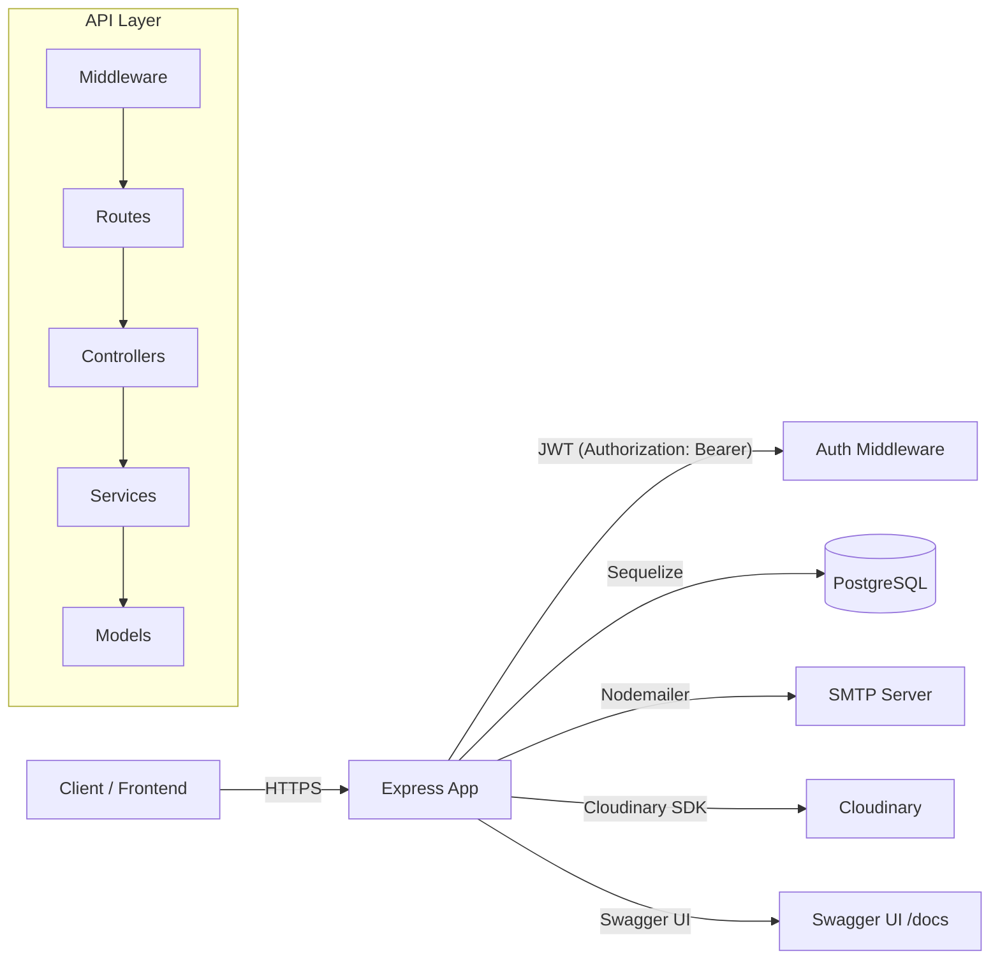

## Flixly API

YouTube‑style backend API with authentication, channels, videos, comments, uploads, and Cloudinary integration.

---

### Badges

[](https://nodejs.org)
[](https://expressjs.com)
[](https://www.postgresql.org)
[](https://sequelize.org)
[](https://swagger.io)
[](https://cloudinary.com)
[](https://jestjs.io)
[](./LICENSE)
[](./CONTRIBUTING.md)

---

### Table of Contents

- [Overview](#overview)
- [Features](#features)
- [Tech Stack](#tech-stack)
- [Architecture](#architecture)
- [Project Structure](#project-structure)
- [Installation](#installation)
- [Usage](#usage)
- [API Documentation](#api-documentation)
- [Environment Variables](#environment-variables)
- [Screenshots / Demo](#screenshots--demo)
- [Testing](#testing)
- [Deployment](#deployment)
- [Contributing](#contributing)
- [License](#license)
- [Credits](#credits)

### Overview

Flixly API is a RESTful backend for a video platform, providing user authentication (local + Google OAuth), channels, video CRUD and interactions (views, likes, comments), tag‑based discovery, and media uploads to Cloudinary. Responses follow the JSend format for consistency. Swagger UI is included for interactive API docs.

### Features

- **Authentication**

  - Local register, email verification, login, refresh, logout: `/api/v1/auth/local/*`
  - Google OAuth 2.0 (Passport): `/api/v1/auth/google`, `/api/v1/auth/google/callback`
  - Password reset via email: `/api/v1/auth/password/reset`

- **Users**

  - Get/update profile, change password, delete account: `/api/v1/users/me`, `/api/v1/users/me/password`
  - Subscriptions list and feed: `/api/v1/users/me/subscriptions`, `/api/v1/users/me/subscriptions/feed`
  - Watch history and liked videos (public only): `/api/v1/users/me/views`, `/api/v1/users/me/likes`
  - Public profile by username: `/api/v1/users/{username}`

- **Channels**

  - Create/get/update/delete my channel: `/api/v1/channels/me`
  - Public channel by username: `/api/v1/channels/{username}`
  - List my/public channel videos with sorting and filters
  - Subscribers list (owner only), subscribe/unsubscribe by username

- **Videos**

  - Discover public videos, search by query/tags, trending (experimental): `/api/v1/videos`, `/api/v1/videos/search`, `/api/v1/videos/trending`
  - Create draft, get/update/delete my video, publish now/schedule
  - Record views with watch time; like, dislike, remove reaction; list reactions (owner only)
  - Public video details with channel, tags, and comments

- **Comments**

  - Add comment on a video, list comments (with replies)
  - Update/delete comment (owner or video owner rules as implemented)

- **Tags**

  - List tags (search, popular); list videos by tag
  - Delete tag (admin only)

- **Upload & Media Processing**

  - Upload video file for a draft: `/api/v1/upload/video/{videoId}`
  - Upload images for user avatar, channel avatar/banner, or video thumbnail: `/api/v1/upload/image/{processId}?type=...`
  - Upload/processing status: `/api/v1/upload/status/{videoId}`
  - Local temp storage via Multer, content-type validation via file-type, remote upload to Cloudinary with eager transforms

- **Operational**
  - Rate limiting with express-rate-limit
  - Request duration logging
  - JSend responses, centralized validation and error handling
  - Swagger UI served at `/docs`, spec in `swagger.yaml`

### Tech Stack

- **Runtime/Framework**: Express 5.1 (ES Modules), EJS
- **Database/ORM**: PostgreSQL (`pg`/`pg-hstore`), Sequelize 6, `sequelize-cli`
- **Auth**: `jsonwebtoken`, Passport Google OAuth 2.0
- **Validation**: `express-validator`
- **Uploads/Media**: `multer`, `file-type`, Cloudinary SDK
- **Email**: `nodemailer`
- **Security/Utility**: `cors`, `helmet`, `cookie-parser`, `express-rate-limit`, `jsend-middleware`, `dotenv`
- **Docs**: `swagger-ui-express`, `yamljs`
- **Testing**: `jest`, `supertest`

### Architecture



### Project Structure

```text
Flixly-API/
  src/
    app.js
    server.js
    routes/ (auth, user, channel, video, comment, tag, upload, pages)
    controllers/ (feature-aligned)
    services/ (business logic)
    middlewares/ (auth, validation, rate limit, uploader, swagger)
    validators/
    utilities/ (JWT, cookies, mail, errors, helpers)
    views/ (EJS templates)
  database/
    models/ (Sequelize models/bootstrap)
    migrations/ (schema)
  config/ (env, db, cloudinary, multer, passport, constants)
  public/ (static: upload helper page assets)
  swagger.yaml (OpenAPI spec)
  package.json
```

### Installation

Prerequisites:

- PostgreSQL database accessible with a user/password
- Cloudinary account (for media storage)
- An SMTP provider (e.g., Gmail SMTP) for emails

Steps:

1. Clone and install

```bash
git clone <your-fork-or-repo-url>
cd Flixly-API
npm install
```

2. Create a `.env` file (see [Environment Variables](#environment-variables)).

3. Initialize the database

```bash
# Create database and run migrations (uses values from .env)
npm run db:create
npm run db:migrate
```

4. Start development server

```bash
npm run dev
# server: http://localhost:<DEVELOPMENT_PORT or 3000>/
# docs:   http://localhost:<port>/docs
```

### Usage

Typical flow:

1. Register and verify email (or use Google OAuth)
2. Login to obtain an access token (Bearer) and refresh token cookie
3. Create your channel
4. Create a video draft, then upload video and thumbnail
5. Publish the video (now or schedule)

Examples (curl):

```bash
# Register (local)
curl -X POST http://localhost:3000/api/v1/auth/local/register \
  -H "Content-Type: application/json" \
  -d '{
    "firstName":"John","lastName":"Doe","username":"john_doe",
    "email":"john@example.com","password":"Password123!","confirmPassword":"Password123!"
  }'

# Login (receive accessToken; refreshToken set as httpOnly cookie)
curl -X POST http://localhost:3000/api/v1/auth/local/login \
  -H "Content-Type: application/json" \
  -d '{"email":"john@example.com","password":"Password123!"}'

# Create my channel
curl -X POST http://localhost:3000/api/v1/channels/me \
  -H "Authorization: Bearer <ACCESS_TOKEN>" \
  -H "Content-Type: application/json" \
  -d '{"username":"john_channel","name":"John Channel","description":"Hello"}'

# Create a video draft
curl -X POST http://localhost:3000/api/v1/videos/me \
  -H "Authorization: Bearer <ACCESS_TOKEN>" \
  -H "Content-Type: application/json" \
  -d '{"title":"My First Video","tags":["intro","hello"]}'

# Upload video file (multipart/form-data)
curl -X POST http://localhost:3000/api/v1/upload/video/<VIDEO_ID> \
  -H "Authorization: Bearer <ACCESS_TOKEN>" \
  -F video_file=@/path/to/video.mp4

# Upload thumbnail image
curl -X POST "http://localhost:3000/api/v1/upload/image/<VIDEO_ID>?type=thumbnail" \
  -H "Authorization: Bearer <ACCESS_TOKEN>" \
  -F image_file=@/path/to/thumbnail.jpg

# Publish now
curl -X PATCH http://localhost:3000/api/v1/videos/me/<VIDEO_ID>/publish \
  -H "Authorization: Bearer <ACCESS_TOKEN>"
```

Extras:

- Static helper UI for uploads: `GET /pages/upload`
- JSend responses: `{ status: "success" | "fail" | "error", data? }`
- Rate limit enabled globally

### API Documentation

- Swagger UI available at: `http://localhost:<port>/docs`
- OpenAPI source: `./swagger.yaml`
- Security:
  - Most endpoints require `Authorization: Bearer <accessToken>`
  - Refresh and logout use an HTTP‑only `refreshToken` cookie scoped to `/api/v1/auth`

### Environment Variables

Create a `.env` file with the following keys:

```dotenv
# App
NODE_ENV=development
DEVELOPMENT_PORT=3000
TESTING_PORT=3030

# Database (PostgreSQL)
DB_HOST=localhost
DB_PORT=5432
DB_NAME=flixly
DB_USER=postgres
DB_PASSWORD=postgres

# JWT
ACCESS_TOKEN_SECRET=your_access_secret
REFRESH_TOKEN_SECRET=your_refresh_secret
RESET_TOKEN_SECRET=your_reset_secret
VERIFY_TOKEN_SECRET=your_verify_secret

# Google OAuth
GOOGLE_CLIENT_ID=your_google_client_id
GOOGLE_CLIENT_SECRET=your_google_client_secret

# Email (SMTP)
SMTP_HOST=smtp.gmail.com
SMTP_PORT=587
SERVER_MAIL=you@example.com
SERVER_MAIL_PASS=your_app_password
SUPPORT_MAIL=support@example.com

# Cloudinary
CLOUDINARY_CLOUD_NAME=your_cloud_name
CLOUDINARY_API_KEY=your_api_key
CLOUDINARY_API_SECRET=your_api_secret

# Frontend (for email links)
FRONTEND_URL=http://localhost:5173
```

Notes:

- JWT secrets must be set; requests will fail if they are missing.
- Ensure database credentials match an accessible PostgreSQL instance.
- Cloudinary credentials are required for media uploads to succeed.

### Screenshots / Demo

- Upload helper page: `http://localhost:<port>/pages/upload`

### Testing

Run tests:

```bash
npm test
```

Testing stack: Jest + Supertest. Utility tests live under `__test__/utilities`.

### Deployment

- Provide production env vars (especially DB and JWT secrets, Cloudinary, SMTP)
- Set `NODE_ENV=production`
- Run database migrations

```bash
npm run db:migrate
npm start
```

Host on any Node‑friendly platform (e.g., a VPS, Docker, or a PaaS). Reverse proxy TLS and route `/docs` if exposing API docs.

### Contributing

Contributions are welcome!

- Fork the repo and create a feature branch
- Add tests for new behavior when possible
- Run lint/tests locally before opening a PR
- Open an issue to discuss substantial changes

### License

This project is licensed under the ISC License. See the license field in `package.json`.

### Credits

- Author: Ahmed Reda
- Libraries/Services: Express, Sequelize, PostgreSQL, Cloudinary, Nodemailer, Passport, JSON Web Tokens, express‑validator, Swagger UI
